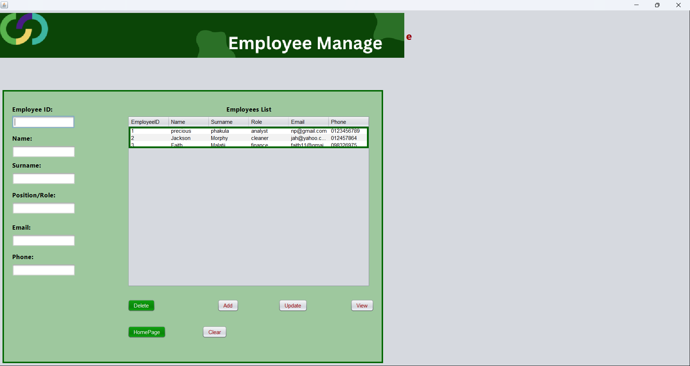
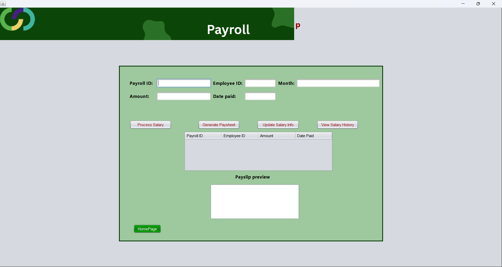

# Employee Management System - Desktop

A Java Swing desktop application built for managing employees, departments and payroll using JavaDB (Apache Derby) as the embedded database. Built as part of PRG361 Milestone 2 at Belgium Campus ITversity.

---

## What The App Does

- Add, view, update and delete employees
- Manage departments and link employees to departments
- Process payroll and generate payslips
- Store all data in a local JavaDB/Derby database
- Runs completely offline on any Windows PC

---

## Screenshots






---

## Technologies Used

| Technology | Purpose |
|------------|---------|
| Java | Core programming language |
| Java Swing | Desktop GUI framework |
| JavaDB / Apache Derby | Embedded database |
| JDBC | Database connectivity |
| NetBeans IDE | Development environment |
| OOP | Programming principles |

---

## Project Structure

```
Employee_Management_System_GUI_FINAL/
├── src/
│   ├── Person.java          # Abstract parent class
│   ├── Employee.java        # Employee class extending Person
│   ├── Department.java      # Department model class
│   ├── Payroll.java         # Payroll model class
│   ├── DBConnection.java    # Database connection and CRUD operations
│   ├── MainDashboard2.java  # Main dashboard GUI
│   ├── EmployeeManagement.java   # Employee management screen
│   ├── DepartmentManagement.java # Department management screen
│   └── PayrollManagement.java    # Payroll management screen
├── lib/
│   ├── derby.jar
│   ├── derbyshared.jar
│   └── derbytools.jar
└── pictures/
    ├── background.png
    ├── background2.png
    └── maindash.png
```

---

## OOP Principles Applied

- **Abstraction** - Person.java is an abstract class with abstract method getRole()
- **Inheritance** - Employee extends Person and inherits name, phone and email
- **Encapsulation** - All fields are private with getters and setters
- **Polymorphism** - getRole() is overridden in Employee class

---

## Database Tables

```sql
-- Department Table
CREATE TABLE Department (
    department_id   INT PRIMARY KEY,
    department_name VARCHAR(50)
);

-- Employee Table
CREATE TABLE Employee (
    emp_id        INT PRIMARY KEY,
    full_name     VARCHAR(100),
    department_id INT REFERENCES Department(department_id),
    role          VARCHAR(50),
    phone         VARCHAR(20),
    email         VARCHAR(100),
    salary        DOUBLE
);

-- Payroll Table
CREATE TABLE Payroll (
    payroll_id INT PRIMARY KEY,
    emp_id     INT REFERENCES Employee(emp_id),
    month      VARCHAR(50),
    amount     DOUBLE,
    date_paid  DATE
);
```

---

## How To Run

1. Make sure you have **Java JDK 8 or higher** installed
2. Clone or download this repository
3. Open the project in **NetBeans IDE**
4. Right-click the project and select **Properties**
5. Under Libraries add the 3 Derby JAR files from the lib folder
6. Press **F6** or click the green Run button
7. The app will launch and automatically create the database on first run

---

## Author

**Nkosinathi Skosana**
- GitHub: [Precious0205](https://github.com/Precious0205)
- LinkedIn: [nkosinathi-skosana](https://www.linkedin.com/in/nkosinathi-skosana-40a4a3331)
- Portfolio: [Precious0205.github.io](https://Precious0205.github.io)

---

## Institution

Belgium Campus ITversity
PRG361 - Milestone 2 - 2026
